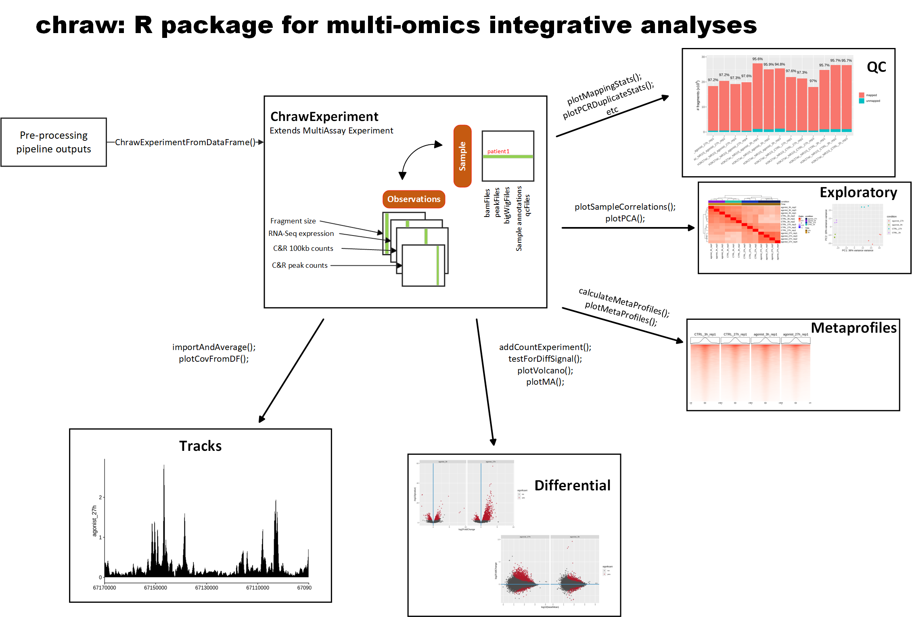

## Chraw: Chromatin Analysis Workflow [v1.0.0, for R] 
 
---

## Summary
---
chraw is an R package for the analysis of chromatin data and developed by Alejandro Reyes, Sebastian Steinhauser, Christian Kolter and Ricardo Rosa Junior (alejandro.reyes_quiroz@novartis.com, sebastian.steinhauser@novartis.com, christian.kolter@novartis.com and ricardo.rosa@hc.fm.usp.br). It is attended for chromatin data processed by ATAC-seq, CUT&RUN and ChIP-seq [pipelines](https://www.encodeproject.org/pipelines/). Nevertheless, the workflow can also handle data produced with other pipelines. Genome assemblies hg19, hg38, mm10 and rn6 assemblies are supported through the workflow analysis. 

This package builds on top of MultiAssayExperiment and aims to be a simplified version of multiple R-packages (DESeq2, DiffBind, corrplot, ChIPseeker,...) that normally need a substantial contribution of the user in terms of input and comprehension of the documentation. Each major analysis step is shrinked to a single function (differential analysis, correlation plots, PCA,...) and only requires a few inputs from the user. 

The workflow was tested on various cell lines and  experimental designs. 

Once the package is installed, we are ready to start our chromatin analysis.

